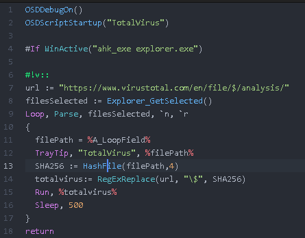

# language-ahk package

This package adds syntax highlighting support for the Autohotkey scripting language.

It was created based on the Notepad++ autohotkey xml file which can be found here: http://ahkscript.org/boards/viewtopic.php?f=7&t=50

